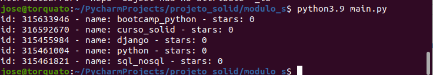

# SOLID 

</em_construção>

---

##Módulo S

Primeiramente foi feito uma classe canivete fazia de tudo um pouco, ferindo assim o primeiro principio.
S - Single Responsibility Principle

Após refatorar agora temos: 
- Cada classe com sua própria funcionalidade.
- Criando models para poder expandir o código sem problemas.

### Comando para iniciar no shell
```shell script
python3.9 main.py
```


 